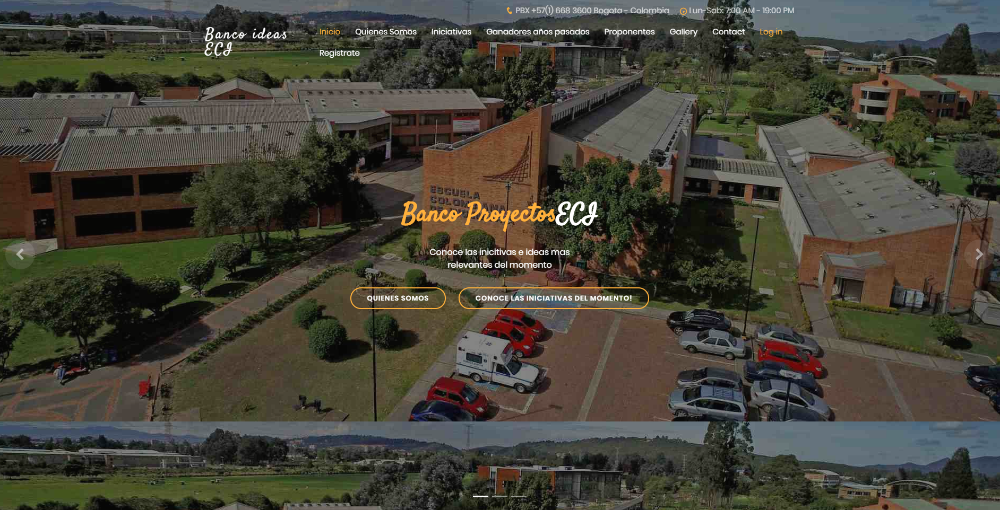
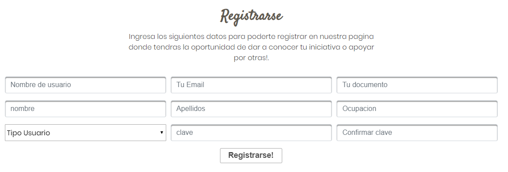
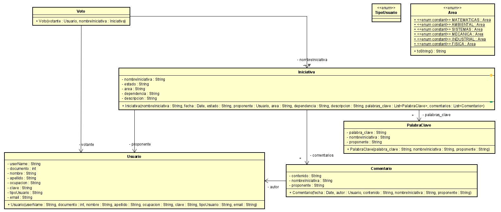

### Escuela Colombiana de Ingeniería Julio Garavito
### Ciclos de Vida del desarrollo de Software – CVDS

## Proyecto 2020-1-ECI-Banco de proyectos

# Integrantes

| Developer |
| :--: |
| David Otálora |
| Alan Marin |
| Paola Cuellar |

**Profesor Oscar Ospina**: Dueño del producto

## Descripción

es una herramienta donde la comunidad universitaria de la Escuela Colombiana de Ingeniería Julio Garavito pueden registrar sus iniciativas e ideas de proyectos para ser desarrollados o gestionados por la PMO de la Escuela. 

## Manual del Usuario

* [El manual del usuario lo encontrarás disponible dando clic aquí](https://github.com/DDRBernal/2020-1-PROYCVDS-DavidOtalora-AlanMarin-PaolaCuellar/blob/master/MANUALDELUSUARIO.pdf)
## Funcionalidades importantes

La página principal permite la navegación para conocer la comunidad   
  

Se permite el registro de nuevos usuarios para acceder a información completa de iniciativas y poder interactuar con ellas  
   
     

# Arquitectura y diseño

Modelo E-R 

 

Diagrama de clases

 

## Capas

 - Aplicación
 - Persistencia
 - Presentación

## Tecnologías utilizadas

 - Primefaces
 - Guice
 - Java
 - PostgreSQL
 - XHTML
 - CSS

* [Enlace a la aplicación en Heroku](https://proycvds-2020-1-otaloramarin.herokuapp.com/)
* [Enlace al sistema de integración continua](https://app.circleci.com/pipelines/github/DDRBernal/2020-1-PROYCVDS-DavidOtalora-AlanMarin-PaolaCuellar)

## Descripción de la metodología

  Se implementó la metodología de SCRUM con los principios de las técnicas ágiles para el desarrollo del proyecto; los integrantes no tuvieron un rol definido.

